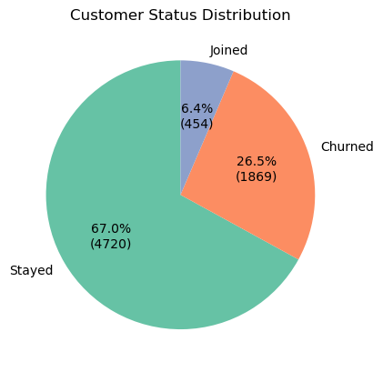
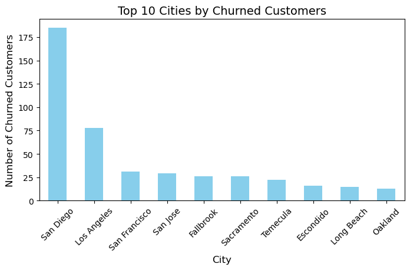
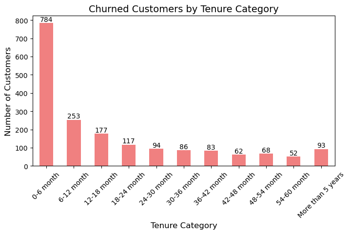
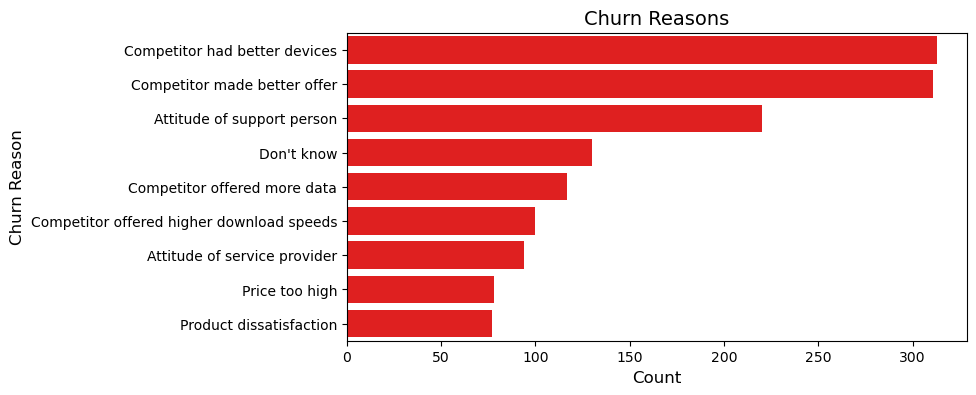
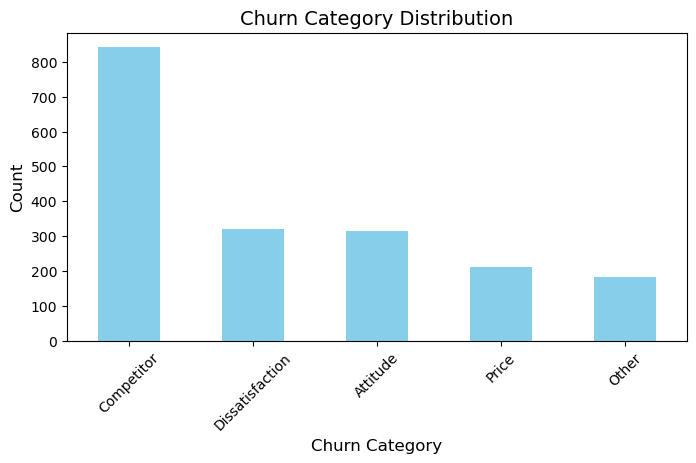
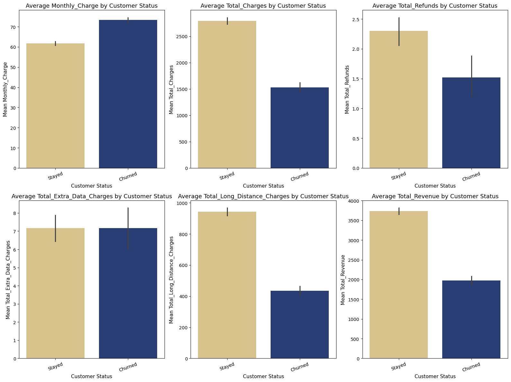

# Telecom Customer Churn Analysis
*A Strategic Assessment of Customer Churn & Retention Drivers*

<p align="left">
  
  
  
  
  
</p>

---

## 📌 Project Summary

| Category | Details |
|----------|---------|
| **Domain** | Telecom Customer Analytics |
| **Business Objective** | Identify churn drivers & design actionable retention strategies |
| **Dataset Size** | 7,043 customers × 38 features |
| **Deliverables** | KPIs, segmentation, churn insights, strategic recommendations |
| **Tech Stack** | Python, Pandas, NumPy, Seaborn, Matplotlib |
| **Business Impact** | Reduce churn, increase CLV, improve onboarding, pricing & service |

---

## 📊 Key Highlights at a Glance

- Analyzed **7,000+ customer profiles**  
- Identified **27% churn rate** with early-tenure dominance  
- Discovered **competitor switching** as the leading churn reason (~44%)  
- Found **fiber users** churn significantly more due to competition  
- Uncovered **2–3× higher churn** among customers without add-on services  
- Mapped **55% churn within first-year**, highlighting onboarding gaps  
- Generated **targeted strategies** for Marketing, CX, Product & Strategy teams  

---

## Repository Structure 

```
Telecom-Churn-Analysis/
│
├── data/
│   └── Telecom_Customer_Churn.csv
│
├── notebook/
│   └── CHURN_ANALYSIS.ipynb
│
├── images/
│   ├── Financial_metrics.png
│   ├── status_distribution_pie.png
│   ├── churn_by_city.png
│   ├── churn_by_tenure_category.png
│   ├── churn_reasons.png
│   └── churn_category_distribution.png
│
└── README.md

```

---

## 📘 Table of Contents

| Section | Link |
|--------|------|
| Executive Overview | [Go to Section](#executive-overview) |
| Problem Statement | [Go to Section](#problem-statement) |
| Project Objectives | [Go to Section](#project-objectives) |
| Project Workflow | [Go to Section](#project-workflow) |
| Dataset Description | [Go to Section](#dataset-description) |
| Data Preparation & Cleaning | [Go to Section](#data-preparation--cleaning) |
| Feature Engineering | [Go to Section](#feature-engineering) |
| Exploratory Data Analysis (EDA) | [Go to Section](#exploratory-data-analysis-eda) |
| Key Visualizations  | [Go to Section](#key-visualizations) |
| Key KPI Highlights | [Go to Section](#key-kpi-highlights) |
| Key Insights | [Go to Section](#key-insights) |
| Strategic Recommendations | [Go to Section](#strategic-recommendations) |
| Business Impact | [Go to Section](#business-impact) |
| Results Summary | [Go to Section](#results-summary) |
| Technologies Used | [Go to Section](#technologies-used) |
| Skills Demonstrated | [Go to Section](#skills-demonstrated) |
| Conclusion | [Go to Section](#conclusion) |

---

## Executive Overview

Telecom operators compete in a saturated, price-sensitive market where even small increases in churn directly impact profitability, market share, and customer lifetime value. This project analyzes customer-level data to identify key churn patterns and translate them into actionable insights for Marketing, Customer Experience (CX), Product, and Strategy teams.

It provides clarity on:

- **High-risk customer segments**
- **Behavioral and usage patterns linked to churn**
- **Service, billing, and experience gaps**
- **Key levers that improve retention and reduce churn**

---

## Problem Statement

Telecom operators face rising customer churn but often lack clear visibility into what is driving it and where customer journeys are breaking. Growing competition, varied service bundles, and complex billing make it difficult to pinpoint:

- **Which customer groups are disengaging**
- **What service or pricing issues lead to dissatisfaction**
- **Why early-life customers churn at disproportionately high rates**
- **Which retention interventions would be most effective**

Without a data-backed understanding of these factors, retention efforts remain broad, reactive, and costly.  
This project addresses that gap by systematically diagnosing churn drivers and quantifying risk across customer segments.

---


## Project Objectives

- Identify primary demographic, behavioral & service churn drivers  
- Compare churn vs retention across contract type, charges, add-ons, internet type, tenure  
- Engineer analytical features to enhance churn analysis and interpretation  
- Generate actionable insights to assist retention teams  
- Build a foundation for predictive churn modeling  

---

## Project Workflow

```

Raw Data -→ Data Cleaning -→ Feature Engineering -→ EDA -→ Visualizations -→ Insights -→ Recommendations


```

## Dataset Description

**Source:** Maven Telecom Customer Churn Challenge  
**File:** `Telecom_Customer_Churn.csv`  
**Size:** 7,043 rows × 38 columns  

The dataset captures customer demographics, service subscriptions, billing behavior, and churn outcomes—providing a comprehensive foundation for churn pattern analysis. The features span four key categories:

- **Demographics** → Age, gender, dependents, geography  
- **Account Information** → Tenure, contract type, billing method, payment mode  
- **Service Usage** → Internet type, phone services, add-ons, data consumption  
- **Customer Status** → Active / Churned / Inactive, churn category, churn reason  

### Columns Overview

| **Column**            | **Description**                 | **Data Type** |
|-----------------------|---------------------------------|----------------|
| Customer ID           | Unique customer identifier      | object         |
| Gender                | Male / Female                   | object         |
| Age                   | Customer age                    | int64          |
| Married               | Marital status                  | object         |
| Number of Dependents  | Count of dependents             | int64          |

*This table shows the first five columns.  
A full, detailed data dictionary is available in the notebook (`CHURN_ANALYSIS.ipynb`).*


---


## Data Preparation & Cleaning

**Notebook:** `CHURN_ANALYSIS.ipynb`

### Core Cleaning Activities

- Inspected dataset structure, datatypes, and distribution profiles  
- Managed missing values and inconsistencies  
- Standardized categorical values and corrected mislabeled entries  
- Converted numerical fields stored as strings to appropriate data types  
- Addressed duplicate records and removed redundant fields  
- Validated relationships between tenure, billing fields, and charges  

The cleaned dataset forms the foundation for reliable exploratory analysis.

---

## Feature Engineering

To improve analytical depth and interpretability:

- Tenure Groups (0–12, 12–24, 24–48, etc.) were created to segment customer lifecycle stages
- Categorical attributes were standardized and consolidated for comparison
- Engineered fields were added to capture service bundle usage and customer behavior patterns
- Service-level indicators were transformed to enable clearer customer segmentation for churn analysis

These enhancements significantly improved the detection of churn patterns across customer segments.

---

## Exploratory Data Analysis (EDA)

The EDA focused on understanding customer behavior, churn patterns, and key lifecycle risk indicators.

### Univariate Analysis
- Tenure and monthly charge distributions  
- Contract types and service configurations  
- Core demographic attributes  

### Bivariate Analysis
- Churn relationships across contract type, internet service, and payment method  
- Churn variation by tenure groups and billing levels  

### Multivariate Analysis
- Correlation patterns across financial and service variables  
- Churn behavior across bundled services and customer segments  

### Visualization Summary
- Countplots, histograms, boxplots, bar charts, and correlation heatmaps  
- **Tools Used:** Matplotlib, Seaborn

---

### Key Visualizations

<table>
  <tr>
    <td align="center">
      <br>
      <sub><b>Customer Status Distribution</b></sub>
    </td>
    <td align="center">
      <br>
      <sub><b>Top Cities by Churned Customers</b></sub>
    </td>
    <td align="center">
      <br>
      <sub><b>Churn by Tenure Category</b></sub>
    </td>
  </tr>

  <tr>
    <td align="center">
      <br>
      <sub><b>Churn Reasons</b></sub>
    </td>
        <td align="center">
      <br>
      <sub><b>Churn Category Distribution</b></sub>
    </td>
    <td align="center">
      <br>
      <sub><b>Financial Metrics by Customer Status</b></sub>
    </td>
  </tr>
</table>

---

## Key KPI Highlights

| KPI | Value | Interpretation | Recommended Action |
|------|--------|----------------|--------------------|
| **Overall Churn Rate** | ~27%  | Higher than industry benchmark | Prioritize churn-reduction strategy |
| **First-Month Churn** | Very High | Weak onboarding experience | Strengthen welcome journey |
| **Fiber Optic Churn** | High  | Competitor pressure | Improve pricing & fiber reliability |
| **Churn Within First Year** | 55% | Early lifecycle churn | Enhance early engagement |
| **Add-On Deficit Churn** | 2–3× Higher | Low stickiness | Promote bundled add-ons |
| **Competitor Churn** | ~44% | High competitive threat | Launch loyalty/anti-switch programs |

---

## Key Insights

### **1. Customer Profile & Demographics**
- Churn is highest in **San Diego** and **Los Angeles**  
- **Single / non-married customers** churn more; married customers are more stable  
- **Low long-distance usage** signals early disengagement

### **2. Contract & Tenure Patterns**
- **Month-to-month plans** show the highest churn  
- **55% of churn occurs within the first year**, with a major spike in the **first month**  
- **Family / multi-line plans** reduce churn compared to single-line usage  

### **3. Services, Add-Ons & Competitor Influence**
- **Fiber Optic users** churn at higher rates  
- Lack of **add-ons** (security, backup, device protection, tech support) increases churn  
- **Competitor switching** is the leading churn driver due to better offers, devices, speeds, and data plans  

### **4. Pricing, Billing & Customer Experience**
- Churned customers had **higher monthly charges** but **lower lifetime revenue**  
- **Poor customer service** caused ~310 churn cases  
- **Bank withdrawal** and **paperless billing** users churn more  
- Retained customers often received **refunds or adjustments**, indicating issue resolution supports retention  

---

## Strategic Recommendations

### 1. Strengthen Early-Lifecycle Experience
- Redesign the first 30–60 day onboarding journey.  
- Improve clarity of initial billing and plan benefits.  

### 2. Increase Product Value & Customer Stickiness
- Introduce bundled add-on packages to reinforce service attachment.  
- Promote multi-line and family plans to improve account-level retention.  

### 3. Mitigate Competitive Switching
- Deploy targeted loyalty programs for high-risk segments.  
- Enhance fiber-based offerings (pricing, device upgrades, speed tiers).  

### 4. Enhance Customer Service Effectiveness
- Strengthen issue resolution processes to ensure customer concerns are effectively resolved during the initial contact.  
- Prioritize resolution of high-frequency customer complaints.  

### 5. Improve Billing Transparency & Predictability
- Simplify bill format and provide proactive billing estimates.  
- Introduce alerts for unusual usage and potential overage charges. 

---

## Business Impact

This analysis supports telecom leaders in:

- Reducing churn through high-impact interventions
- Improving onboarding effectiveness
- Strengthening competitive differentiation
- Increasing ARPU and customer lifetime value
- Prioritizing investments in service quality and add-ons
- Identifying at-risk customer clusters for targeted campaigns

---

## Results Summary

- Churn driven primarily by contract type, pricing, service add-ons, and fiber competitiveness
- Clear early-tenure vulnerability across customer base
- Competitor switching accounts for a significant share of churn
- Multi-team, actionable retention roadmap developed
- Dataset fully prepared for predictive modeling & BI dashboards

---

## Technologies Used

- **Python** – Analysis  
- **Pandas** – Data wrangling  
- **NumPy** – Numerical operations  
- **Matplotlib & Seaborn** – Visualization  
- **Jupyter Notebook** – Workflow environment  

---

## Skills Demonstrated

- Data Preparation & Cleaning
- Feature Engineering
- Exploratory Data Analysis
- Visualization & Pattern Recognition
- Telecom Domain Understanding
- Business Strategy Formulation

---

## Conclusion

This analysis provides telecom organizations with a clear, data-driven understanding of the behavioral, financial, and service factors influencing customer churn. By identifying high-risk segments and diagnosing key churn drivers, the study equips Marketing, CX, Product, and Strategy teams with actionable insights to strengthen retention programs, enhance customer experience, and improve overall lifetime value. The findings serve as a foundation for targeted interventions, future predictive modeling, and long-term churn reduction initiatives.

---

## ⭐ Support
If you found this project useful, please ⭐ the repository!
